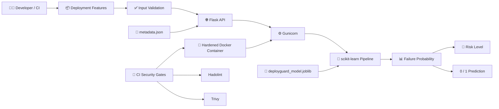
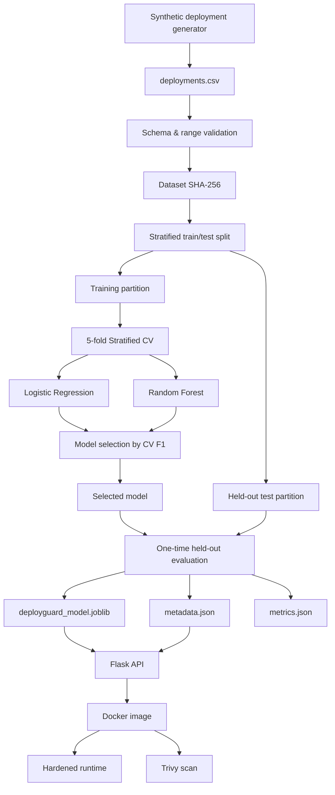
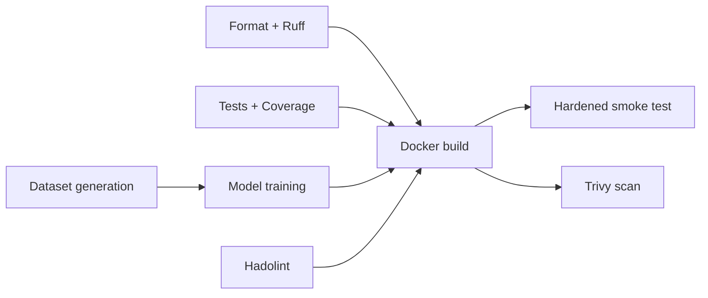

# 🛡️ DeployGuard ML

[](https://github.com/moahmedzaghloula/deployguard-ml/actions/workflows/ci.yml)

**Predict deployment failure risk before release — with reproducible ML, strict artifact lineage, a production-style API, hardened containers, and CI security gates.**

DeployGuard ML is a portfolio MLOps project that demonstrates how machine learning can be integrated into a software delivery workflow without treating the model as an isolated notebook artifact.

The project covers the lifecycle from deterministic synthetic data generation to model selection, artifact validation, API serving, container hardening, automated testing, vulnerability scanning, and CI quality gates.

> **Important:** DeployGuard ML currently uses synthetic data. Its evaluation metrics demonstrate that the engineering pipeline works as designed; they must not be interpreted as production deployment-failure accuracy.

---

## ✨ What this project demonstrates

DeployGuard ML connects software delivery engineering with machine learning engineering.

It demonstrates:

- Reproducible synthetic data generation.
- Explicit input and target schemas.
- Data validation before model training.
- Prevention of obvious post-deployment label leakage.
- Train/test separation before model selection.
- Cross-validation on the training partition.
- Multiple model candidates.
- Artifact lineage through dataset SHA-256 metadata.
- Versioned model metadata.
- Strict API request validation.
- Flask application-factory architecture.
- Gunicorn-based serving.
- Docker multi-stage builds.
- Non-root containers.
- Read-only container filesystems.
- Linux capability removal.
- CPU and memory limits.
- CI formatting, linting, tests, training, container tests, and security scanning.
- Hadolint Dockerfile analysis.
- Trivy container vulnerability scanning.

---

## 🎯 Problem statement

Software deployments fail for many reasons: unusually large changes, failing tests, low test coverage, previous release instability, limited team experience, release timing, and other operational factors.

DeployGuard ML models the following question:

> Given information available **before deployment**, what is the estimated probability that the deployment will fail?

The system is intentionally designed around pre-deployment features. Post-deployment outcomes such as rollback status, outage duration, or incident count are excluded because using them would create label leakage.

DeployGuard ML should be viewed as a decision-support experiment rather than an autonomous deployment gate.

---

## ⚙️ Why this matters to DevOps and MLOps

A traditional ML project can stop at:

```text
data → notebook → model
```

A production-oriented ML system has additional responsibilities:

```text
data
  ↓
validation
  ↓
reproducible training
  ↓
evaluation
  ↓
versioned artifact
  ↓
API contract
  ↓
container
  ↓
security controls
  ↓
CI validation
  ↓
deployment decision support
```

That transition is where DevOps practices become MLOps practices.

DeployGuard ML focuses heavily on that transition.

---

## 🏗️ Architecture



---

## 🔄 ML lifecycle



---

## 📂 Repository structure

```text
deployguard-ml/
├── .github/
│   └── workflows/
│       └── ci.yml
├── artifacts/
│   └── .gitkeep
├── data/
│   ├── processed/
│   │   └── .gitkeep
│   └── raw/
│       └── .gitkeep
├── reports/
│   └── figures/
│       └── .gitkeep
├── src/
│   └── deployguard/
│       ├── __init__.py
│       ├── app.py
│       ├── eda.py
│       ├── generate_data.py
│       ├── smoke.py
│       ├── train.py
│       └── validate_data.py
├── tests/
│   ├── test_api.py
│   ├── test_data_pipeline.py
│   ├── test_model_training.py
│   └── test_smoke.py
├── .dockerignore
├── .gitignore
├── Dockerfile
├── Makefile
├── pyproject.toml
├── requirements-dev.in
├── requirements-runtime.lock.txt
├── requirements.in
├── requirements.lock.txt
└── README.md
```

The following files are generated and intentionally excluded from Git:

```text
data/raw/deployments.csv
artifacts/deployguard_model.joblib
artifacts/metadata.json
reports/metrics.json
reports/figures/*.png
coverage.xml
.coverage
```

Source code defines how these artifacts are recreated.

---

## 🧾 Dataset

The current dataset is generated deterministically from a fixed random seed and contains synthetic deployment records.

### Feature schema

| Feature | Type | Valid range | Meaning |
|---|---|---:|---|
| `files_changed` | integer | 1–150 | Number of files changed |
| `lines_added` | integer | 1–5000 | Added source lines |
| `lines_deleted` | integer | 0–4000 | Deleted source lines |
| `test_coverage_percent` | float | 30–100 | Test coverage percentage |
| `failed_tests` | integer | 0–40 | Failed pre-deployment tests |
| `previous_deployment_failures` | integer | 0–10 | Prior deployment failures |
| `deployment_hour` | integer | 0–23 | Scheduled deployment hour |
| `is_weekend` | integer | 0–1 | Weekend deployment flag |
| `team_experience_months` | integer | 1–120 | Team experience |

Target:

```text
deployment_failed
```

Allowed values:

```text
0 = deployment succeeded
1 = deployment failed
```

Identifier:

```text
deployment_id
```

The identifier is not used as a model feature.

The generated dataset currently has the following SHA-256 fingerprint:

```text
cec3a2c941a1385a9a4b953d1bd9996d6481d739ea624dcff9fb09a8253ab755
```

That fingerprint is written into model metadata so a trained artifact can be traced back to the exact dataset bytes used during training.

---

## 🧠 Model training

The dataset is split using a deterministic stratified train/test split.

```text
80% training
20% held-out test
```

The held-out test set is separated before model selection.

Two model candidates are evaluated:

```text
LogisticRegression
RandomForestClassifier
```

Model selection uses:

```text
5-fold StratifiedKFold
```

and the primary selection metric is:

```text
F1
```

Only the training partition participates in cross-validation.

The test partition is evaluated after the winning model has been selected.

### Why a Pipeline?

The logistic-regression candidate uses:

```text
StandardScaler
        ↓
LogisticRegression
```

Both transformations are contained inside a scikit-learn `Pipeline`.

This matters because the scaler must be fitted independently inside each cross-validation training fold. Fitting the scaler against the full dataset before cross-validation would leak information across folds.

---

## 📊 Current held-out evaluation

Selected model:

```text
LogisticRegression
```

Model version:

```text
1.0.0
```

Decision threshold:

```text
0.50
```

| Metric | Result |
|---|---:|
| Accuracy | 0.6830 |
| Precision | 0.3098 |
| Recall | 0.6441 |
| F1 | 0.4183 |
| ROC-AUC | 0.7240 |
| False Positive Rate | 0.3086 |
| False Negative Rate | 0.3559 |
| True Negative | 569 |
| False Positive | 254 |
| False Negative | 63 |
| True Positive | 114 |

These numbers describe performance against the current **synthetic held-out dataset only**.

They are not evidence of expected production performance.

---

## 🌐 API

The service uses a Flask application factory and is served by Gunicorn.

| Method | Endpoint | Purpose |
|---|---|---|
| `GET` | `/` | Service discovery |
| `GET` | `/health` | Process liveness |
| `GET` | `/ready` | Model readiness |
| `GET` | `/metadata` | Safe model metadata |
| `POST` | `/predict` | Failure-risk prediction |

### Valid request

```json
{
  "files_changed": 32,
  "lines_added": 850,
  "lines_deleted": 180,
  "test_coverage_percent": 71.5,
  "failed_tests": 2,
  "previous_deployment_failures": 1,
  "deployment_hour": 22,
  "is_weekend": 1,
  "team_experience_months": 18
}
```

The response contains:

```json
{
  "decision_threshold": 0.5,
  "failure_probability": 0.0,
  "model_version": "1.0.0",
  "prediction": 0,
  "risk_level": "low"
}
```

The exact probability depends on the trained model and supplied features.

### Invalid request example

The API rejects unknown fields:

```json
{
  "files_changed": 32,
  "lines_added": 850,
  "lines_deleted": 180,
  "test_coverage_percent": 71.5,
  "failed_tests": 2,
  "previous_deployment_failures": 1,
  "deployment_hour": 22,
  "is_weekend": 1,
  "team_experience_months": 18,
  "rollback_status": 1
}
```

Example status:

```text
422 Unprocessable Entity
```

`rollback_status` is deliberately not part of the feature contract because it represents information that would normally become available after the deployment decision.

---

## 🐧 Fedora local development

Requirements:

```text
Git
Python 3.13+
Docker Engine
GNU Make
```

Create a virtual environment:

```bash
python3 -m venv .venv
```

Activate it:

```bash
source .venv/bin/activate
```

Install locked development dependencies:

```bash
make install
```

Run the full Python quality suite:

```bash
make format-check
make lint
make test
```

Generate and validate data:

```bash
make data
make validate-data
```

Train and validate the model artifact:

```bash
make train
make model-check
```

---

## 🐳 Docker

Build:

```bash
make docker-build
```

The runtime image uses:

- A multi-stage Docker build.
- A dedicated non-root user.
- UID/GID `10001:10001`.
- Gunicorn as the container process.
- A Docker health check.

### Hardened runtime

```bash
docker run \
  --detach \
  --name deployguard-api \
  --publish 127.0.0.1:8000:8000 \
  --read-only \
  --tmpfs /tmp:rw,noexec,nosuid,size=64m \
  --cap-drop ALL \
  --security-opt no-new-privileges=true \
  --memory 512m \
  --cpus 1.0 \
  deployguard-ml:1.0.0
```

These options intentionally limit what a compromised application process can do.

---

## 🧰 Make targets

| Target | Purpose |
|---|---|
| `make install` | Install locked dependencies |
| `make format` | Format Python files |
| `make format-check` | Check formatting without modifying files |
| `make lint` | Run Ruff |
| `make data` | Generate the synthetic dataset |
| `make validate-data` | Validate dataset contract |
| `make eda` | Generate EDA figures |
| `make train` | Train and evaluate candidates |
| `make test` | Run tests |
| `make coverage` | Run tests and produce coverage XML |
| `make model-check` | Validate model and metadata contract |
| `make api` | Start Gunicorn locally |
| `make docker-build` | Build the runtime image |
| `make docker-smoke` | Exercise the running hardened container |
| `make security` | Run Hadolint, secret scanning, and Trivy |
| `make verify` | Run the end-to-end quality pipeline |
| `make clean` | Delete generated artifacts and caches |

---

## 🧪 Testing and coverage

The project includes tests for:

- Dataset determinism.
- Dataset schema.
- Dataset ranges.
- Missing data.
- Identifier uniqueness.
- Model feature contracts.
- Model persistence.
- Prediction probability ranges.
- Model metadata.
- API health and readiness.
- Valid predictions.
- Invalid JSON.
- Missing fields.
- Unexpected fields.
- Invalid types.
- Out-of-range values.
- Missing model artifacts.
- HTTP 404 and 405 behavior.

Run:

```bash
make coverage
```

The terminal reports line coverage and creates:

```text
coverage.xml
```

for CI evidence.

---

## 🔁 CI pipeline

The GitHub Actions workflow runs on:

```text
push to main
pull requests targeting main
manual workflow_dispatch
```

Pipeline:



The workflow intentionally uses read-only repository permissions.

Generated dataset, model, coverage report, and built container image are transferred between isolated jobs using GitHub Actions artifacts.

---

## 🔐 Container security controls

| Control | Implementation |
|---|---|
| Non-root process | `USER 10001:10001` |
| Minimal runtime | Multi-stage Docker build |
| Build context reduction | Strict `.dockerignore` |
| Immutable root filesystem | `--read-only` |
| Writable temporary area | `/tmp` tmpfs |
| Prevent execution from temp | `noexec` |
| Prevent SUID behavior | `nosuid` |
| Linux capabilities | `--cap-drop ALL` |
| Privilege escalation | `no-new-privileges=true` |
| Memory bound | `512m` |
| CPU bound | `1.0` |
| Local-only host binding | `127.0.0.1` |
| Runtime health probe | Docker `HEALTHCHECK` |
| Dockerfile lint | Hadolint |
| Vulnerability scan | Trivy |

Security controls reduce risk; they do not guarantee that the application or image is vulnerability-free.

---

## 🧬 Artifact lineage and reproducibility

The model metadata records:

```text
model name
model version
training timestamp
dataset SHA-256
feature contract
decision threshold
evaluation metrics
Python version
scikit-learn version
selection strategy
```

The relationship is:

```text
source code
   +
dependency lock
   +
random seed
   ↓
dataset bytes
   ↓ SHA-256
model training
   ↓
model artifact
   +
metadata
```

This allows model artifacts to be checked against the dataset fingerprint they were produced from.

---

## 🩺 Troubleshooting

### `ModuleNotFoundError`

Activate the project environment:

```bash
source .venv/bin/activate
```

Then install dependencies:

```bash
make install
```

### Model is not ready

Run:

```bash
make data
make validate-data
make train
make model-check
```

### Docker container name conflict

Inspect:

```bash
docker ps -a --filter name='^/deployguard-api$'
```

Remove only the project container if appropriate:

```bash
docker rm -f deployguard-api
```

### Port 8000 is occupied

Inspect the process or container currently using the port before changing or terminating anything.

### Docker vulnerability gate fails

Do not suppress the finding automatically.

Inspect:

```text
package
installed version
fixed version
severity
vulnerability ID
```

Then determine whether the remediation belongs in:

```text
base image
Python dependency
OS package
application dependency
```

---

## ⚠️ Limitations and responsible use

DeployGuard ML currently has important limitations:

- Training data is synthetic.
- Synthetic relationships were deliberately encoded in the data generator.
- Evaluation therefore measures recovery of those artificial relationships.
- The feature set is intentionally small.
- No real deployment telemetry is currently connected.
- No concept-drift monitor exists.
- No schema registry exists.
- No online model registry exists.
- No authentication or authorization layer exists for the API.
- No TLS termination is implemented inside the application container.
- No distributed tracing is currently included.
- The model should not autonomously block a real production release.

A real implementation should treat the probability as an additional engineering signal, not the sole release decision.

---

## 🔄 DevOps → MLOps mapping

| DevOps concept | DeployGuard MLOps equivalent |
|---|---|
| Source code | ML source + training logic |
| Build artifact | Model artifact |
| Build metadata | Model metadata |
| Integration test | Model/data/API tests |
| Configuration validation | Feature/data contract |
| Container image | Model-serving image |
| Release version | Model/API version |
| Infrastructure monitoring | Model + data monitoring |
| Deployment rollback | Model rollback |
| CI quality gates | ML/data/security gates |
| Software supply chain | ML artifact lineage |

The key idea is that a model is another production artifact that needs versioning, reproducibility, validation, observability, and controlled promotion.

---


## 👤 Author

**Mohamed Zaghloula**

DevOps / Cloud / MLOps Engineering


## 📌 Project status

Current milestone:

```text
v1.0.0 candidate
```

The release is considered ready only after:

```text
local verification
→ pull request
→ GitHub Actions
→ security scan
→ review
→ merge to main
→ release tag
```
